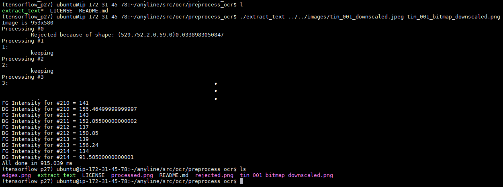

# Optical Character Recognition Demo

-------------------------------------------------------------------------------
Despite not being precisely a recent introduction to Computer Vision,
it would seem like the subfield of Optical Character Recognition is 
not mature yet, as each step of its development is full of nuances and
trade-offs that often require thorough research/experimentation. 

For example, even for a simple use-case like handwriting detection, in which
usually pictures of the text are taken indoors with descent light conditions
and good camera focus, minor details like the font type, the size and the 
orientation of the text lines are enough to affect the accuracy of OCR 
algorithms ( for a nice overview of this and other challenges of OCR check 
[Computerphile's youtube video](https://www.youtube.com/watch?v=ZNrteLp_SvY)). 

## Task Definition

In this demo we will expose and attempt to tackle some of the challenges
that may arise when trying to apply standard OCR algorithms on
considerably more complex use-case: car tires codes (specification numbers).

Imagine you are given this picture and are asked to read the code (not the
brand name, but the tire specification):


You would probably panic at the sight of no white paper sheet margins,
curved text lines, uneven font styles and more importantly, same color for both
fonts and background. There is even a horse in the inscription! 

Fortunately, OCR is a trending field and there is plenty of resources 
we can use to, at the very least, identify everything that is wrong with 
this picture and hopefully preprocess it well enough so that a standard
character classifier can make sense of it.

We will proceed in our task as follows:
1. Browse: Find out what open-source implementations of OCR are there.
2. Test: Take the repo with the best documentation and/or community, set it up
and test it in our given image.
3. Experiment: After the test fails, check the documentation and user forum 
for tweaks/customizations that may help. Experiment after the changes, 
summarize results and analyze them for more insight.
4. Hit the Library: Look up articles on the suspected problem. Ideally, choose
publications for which there is source code available.
5. Asses: Take a new approach or combine the newly found approach 
with the one initially tested. Assess whether the results improved.
6. Benchmark: Define a quality metric, try out other OCR implementations and 
compare them to the current baseline.

## Browse

The is a considerable amount of open-source libraries that offer support for OCR.
However two in particular stand out due to their versatility and extensive
documentation:

* [Tesseract](https://github.com/tesseract-ocr/tesseract): Home of several 
OCR-specific algorithm implementations. Developed in part by OCR pioneer Ray 
Smith and maintained by Google.
* [OpenCV](https://github.com/opencv/opencv): Offers implementations for many
Computer Vision algorithms. Especially useful for preprocessing steps.

Alternatives worth looking at in the future might include
[Ocropy](https://github.com/tmbdev/ocropy), 
[SwiftOCR](https://github.com/garnele007/SwiftOCR), and more specific ones like 
[OpenALPR](https://github.com/openalpr/openalp) (for automatic license plate
recognition). 

For now, `Tesseract` will be our choice for the initial tests, as it offers an
easy-to-use `CLI` in addition to `c++` headers that allow for development of 
custom applications. It also support more advanced features like LSTM-based 
character classification, which we will try out later on. We will also bring 
`OpenCV` along with us as is a requirement of many other libraries and it might 
allows us to glue some code together to create a custom application. In specific,
releases `OpenCV v2.4.9.1` and `Tesseract v4.1.1` will be used on `Ubuntu 16.04`.

## Test

Regarding the environment setup, the 
[src/setup/](https://github.com/slothkong/ocr-demo/tree/master/src/setup)
subdirectory of this repo includes a series of `bash` scripts that may be 
used to easily install both libraries. Note that if we would rather not install
`OpenCV` onto your environment, we could use 
[this Docker image](https://hub.docker.com/r/spmallick/opencv-docker) and start
an isolated and `OpenCV`-ready `Linux` environment.

As a side note, when cloning this repo make sure to also fetch its submodule:

```bash
git clone --recurse-submodules https://github.com/slothkong/ocr-demo
```

Now to the fun part! We can start by running the `Tesseract CLI` and pass to it 
our image and the base name of the file where the detected text is saved. As a
sanity check, let us first process a simple example, a photo of a textbook page,
like the one below:


Even though there is a slight rotation on the text orientation, the characters 
are on focus and there is good contrast between the text and the background. 
When we run the command and check the output we find that every character was
recognized:

```bash
tesseract ../../image/textbook_001.jpeg result
``` 


The library works as expected for the expected type of input image. Now lets us
use it on an unexpected one:

```bash
tesseract ../../image/tin_001.jpeg result
``` 
Not surprisingly, when we check the content of the newly generated `result.txt`, 
the file is empty; no text was recognized:


## Experiment

At this point we have no are entirely sure the recognition files. However, 
[Tesseract's Wiki page](https://github.com/tesseract-ocr/tesseract/wiki/ImproveQuality)
present a several suggestions. As we know, the first stage of OCR algorithms 
often performs input image banalization. Is the binaries version of the 
input image is not good enough, chances are the following stage will not produce
any character matches. The documentation suggests to pass the
` -c tessedit_write_images=1` argument to the `CLI` to save the binarized image
(as `tessinput.tif`) for a later inspection:


Let us compare said intermediate results for the two images we previously 
processed:


A first indication of a potential issue is the fact there is marked difference in
contrast between text and background across the two images. Font is also 
different in size and in proportion with the image margins. So now it might be 
reasonable to argue that what we are missing is different approach for
binarizing the input and perhaps applying some re-scaling. Before we rush
to conclusions however, let us continue experimenting.

Is perhaps unnecessary to mention, but a naive attempt like inverting the color
of the input image in hope the tire code shows better contrast against the
background, will simply not be enough (we tried and failed):


The [Tesseract's Wiki](https://github.com/tesseract-ocr/tesseract/wiki/ImproveQuality)
additionally, points out that the character classification will rely on 
dictionaries to predict the best match (for English as the default language).
Since we are working with English letter codes, as opposed to English vocabulary,
we tried to deactivating dictionary look up by passing the following
arguments `-c load_system_dawg=0 -c load_freq_dawg=0 `.

Unfortunately, this did not have any noticeable effect; the generated  
`results.txt` file is empty, which might be again an indication that our problem
resides on the preprocessing stage rather than in the classification stage:


The 
[Tesseract's User Forum](https://groups.google.com/forum/#!msg/tesseract-ocr/Wdh_JJwnw94/24JHDYQbBQAJ)
Presents interesting analysis on font size. For two versions of the library 
version and two test datasets, the recognition error reaches a minimum when 
capital letters have between 20 and 50 pixels. This specific font is of course 
library-dependent but it gives another reason to believe we ought to re-scale
our input images before staring the processing.


Although automatically rescaling the input is big issue on its own (as we would
need to know upfront what the initial font size is in order to script the 
re-scaling method), for this demo it will suffice to do the re-scaling manually.

One last hint the [documentation](https://github.com/tesseract-ocr/tesseract/wiki/ImproveQuality#page-segmentation-method) 
provides is the `Page Segmentation Mode` adjustment. By default, `Tesseract` expects a page of text when it segments an image. If we just seeking to OCR a small region, we could try a different segmentation mode using the `--psm` argument:

```
  0    Orientation and script detection (OSD) only.
  1    Automatic page segmentation with OSD.
  2    Automatic page segmentation, but no OSD, or OCR.
  3    Fully automatic page segmentation, but no OSD. (Default)
  4    Assume a single column of text of variable sizes.
  5    Assume a single uniform block of vertically aligned text.
  6    Assume a single uniform block of text.
  7    Treat the image as a single text line.
  8    Treat the image as a single word.
  9    Treat the image as a single word in a circle.
 10    Treat the image as a single character.
 11    Sparse text. Find as much text as possible in no particular order.
 12    Sparse text with OSD.
 13    Raw line. Treat the image as a single text line, bypassing hacks that 
 are Tesseract-specific.
```

Since the description of all this segmentation modes is rather cryptic to us, we
decided to write a [batch_process.sh](https://github.com/slothkong/ocr-demo/blob/master/src/ocr/basic_ocr/batch_process.sh)
script that takes an input image and triggers the `Tesseract` execution for each 
of the modes. Since we are also interested in evaluating the effect of font size,
we decided to run the script on two versions of [tin_001.jpeg](https://github.com/slothkong/ocr-demo/blob/master/images/tin_001.jpeg), 
the original (1080x1920) and a downscaled version (480x853). Below is a 
screenshot of the terminal logs when processing the downscaled image:


The [batch_process.sh](https://github.com/slothkong/ocr-demo/blob/223565ce303a57a6349b0d292dad46d7428bcb20/src/ocr/basic_ocr/batch_process.sh#L19) forges the output filename that 
`Tesseract` should use for easy user analysis:


After a quick inspection of the output text files we can conclude that:
1. There is a clear difference on outcome for different page segmentation modes,
with some files containing no files and others holding 10+ text lines.
2. The font size also place a roll, as recognitions for the down scaled image
tend to have less gibberish in them. A good example is the result comparison for 
segmentation mode 6.

 [tin_001_result_psm6.txt](https://github.com/slothkong/ocr-demo/blob/master/images/results/batch_results/tin_001/tin_001_result_psm6.txt): 

```
re
Bee
ies ae
—" ’ ——- —_ Bee’ eae N a, Sey =
\_ - aa a er sas ee: —
BS ere : brn ce
i Tm Tg UU ii re. fa
ae ie) a ‘=
A j eS Mi pa , dA fi ont
j pz Leen rt ome
mT UGLLLLUT TTaeer HHH)
——TaTTTTIIIVIVILAANUAVMUAMLALUANURVALEEMMEC AUER cece CUUULA CUDA RE
WN WN POUT TTL
a mNAN "I Pied eS
pera a Be VE » ~
ane At Ae Bis VI PW, io
| (! |
EE ial EO
f
i 2 :
rs a ota
Le al 7 he S
er ae . . “
```

[tin_001_downscaled_result_psm6.txt](https://github.com/slothkong/ocr-demo/blob/master/images/results/batch_results/tin_001_downscaled/tin_001_downscaled_result_psm6.txt):
```
Lah
‘ = ee a 7
- (SS
‘ = <

i ntat fq ean fe yay ye or

Dae AY AN se (aunts
SS SS SSS ee
| A | =
i i
```

Indeed, after gathering all this evidence, we could argue that besides 
unideal font sizes, our main remaining issue relates to image binarization and 
revolves around the question of: how to deal
with the font and background color similarity?

## Hit the Library

With the insight that we already got through experimentation, we now focus on 
looking for a preprocessing algorithm, one that perhaps allow for [font and 
background color independent text binarization](https://github.com/slothkong/ocr-demo/blob/master/literature/Font%20and%20Backgorund%20Color%20Independent%20Text%20Binarization.pdf) :wink:


Seems like we are in luck. Not only is the paper title fitting, there is also
an open source [Python2 implementation](https://github.com/slothkong/ocr-text-extraction) of it.
Although the repo is a bit outdated, it comes with a [extract_text](https://github.com/slothkong/ocr-text-extraction/blob/master/extract_text) 
script that generates a `.png` binarized version of a given input. If we turn
on the [DEBUG](https://github.com/slothkong/ocr-text-extraction/blob/b26c31d0ca1cca9d6cc9fd532e59c1f1abaad5df/extract_text#L32) 
variable, the script will also save intermediate steps taken, especially good
to keep building an idea of why pictures of tires are difficult to process. When
we executed the script on  [tin_001_downscaled.jpeg](https://github.com/slothkong/ocr-demo/blob/master/images/tin_001_downscaled.jpeg) we obtained:



Note that we trimmed out the middle of the terminal as the debug 
logs are too extensive to fit in a single screenshot. Additionally, note that we 
have added a time measurement statement to the [extract_text](https://github.com/slothkong/ocr-text-extraction/blob/b26c31d0ca1cca9d6cc9fd532e59c1f1abaad5df/extract_text#L334)
script to evaluate its performance. For this particular image the execution time
is ~916 ms, which is perfectly acceptable for academic but the same might not
be true for servicing applications at scale.

Nevertheless, we show here the four resulting images, including the binarized 
one, which is looking amazingly good! Some of the details in the "B" letter got 
lost and there is some noise at the start of the number "2" which might cause 
problems latter one. But in overall the fonts are now in black while the 
background is completely white; this exactly what we needed to assess whether
or not we have arrived to the first working version of our demo.


## Asses

Given the nice preprocessing results that we have already obtained, we want
now to get back to the `Tesseract`. We had mentioned also the it support 
character classification through LSTM execution. As "Deep Learning" brings
and additional level of accuracy to most "Computer Vision" applications, let us
build a small application that interacts with a `Tesseract` object running and
LSTM and for the ideal page segmentation mode for our use case, which seems to 
be "single column" (mode 4). 

The code is located in [lstm_ocr.cpp](https://github.com/slothkong/ocr-demo/blob/master/src/ocr/lstm_ocr/lstm_ocr.cpp). 
We use `C++` as the code base, load the input image
with [cv::imread](https://github.com/slothkong/ocr-demo/blob/223565ce303a57a6349b0d292dad46d7428bcb20/src/ocr/lstm_ocr/lstm_ocr.cpp#L100) 
and feed to the OCR algorithm through the [tesseract::TessBaseAPI](https://github.com/slothkong/ocr-demo/blob/223565ce303a57a6349b0d292dad46d7428bcb20/src/ocr/lstm_ocr/lstm_ocr.cpp#L103).
Keep in mind that now all  the images we pass to the `Tesseract` have been 
manually down scaled first and then binarized with [extract_text](https://github.com/slothkong/ocr-text-extraction/blob/b26c31d0ca1cca9d6cc9fd532e59c1f1abaad5df/extract_text). We did not merge `extract_text` with `lstm_ocr.cpp`
as they use different code bases, but these could be interphased after a few
hours of coding.

Having our first version of `lstm_ocr.cpp` ready, we compile it, throw [tin_001_downscaled_bitmap.png](https://github.com/slothkong/ocr-demo/blob/master/images/results/preprocess_results/tin_001_downscaled/tin_001_downscaled_bitmap.png) at the binary and hold our breath:


Our application displays the recognized text to the terminal and we are pleased 
to see that longest line of text is also the most similar to the tire code. 
Although not all the characters where detected, 11 out 15 are correct (if we 
ignore the black spaces):

    Original  Label: "DOT AFXK WBBM 2419"
    Predicted Label: "- DOr.  ~ AFXK WEbY 12419"

It is not entirely certain why none alphanumeric characters show up but it might,
be to noise in the binarized input image. The same might be said about the 
additional "1" at the beginning of "12419". That could be the next problem we
could look into.

However, if we are feeling bold we might simply assume that tire codes 
are only made up out of alphanumeric characters and that more often
than not the longest recognized text line corresponds to the actual tire code.
After writing a [filterChars()](https://github.com/slothkong/ocr-demo/blob/223565ce303a57a6349b0d292dad46d7428bcb20/src/ocr/lstm_ocr/lstm_ocr.cpp#L26) and a [getLongestLine()](https://github.com/slothkong/ocr-demo/blob/223565ce303a57a6349b0d292dad46d7428bcb20/src/ocr/lstm_ocr/lstm_ocr.cpp#L38) functions to implement the above 
mentioned ideas and run `lstm_ocr` again, we got the final recognition:


    Original  Label: "DOT AFXK WBBM 2419"
    Predicted Label: "DOr     AFXK WEbY 12419"

To further test our application, we gathered 9 additional pictures of tire codes.
We should note that unfortunately not all the pictures got us good results. 
Below are some of the failed examples:

[tin_006.jpeg](./images/tin_006.jpeg):


[tin_010.jpeg](./images/tin_010.jpeg):


One last note about the downsides of our implementation; `lstm_ocr` took in 
average 300 ms to compute each of the test images. If we add to that the 916 ms
spent during preprocessing we are now taking about end-to-end runtime in the 
order of seconds, ~ 1.2 s; again far from ideal for servicing users at big scale.

## Benchmark

Our first attempt to approach this problem utilized as its core a single library 
(`Tesseract`) and an additional binarization script (`extract_text`). The next
step in our investigation should now to look at the alternative libraries we
listed in the "Browse" section. If we were to define or adopt a robust metric 
for evaluating OCR accuracy and gather a big enough dataset of images, we could
potentially benchmark several libraries and algorithms. Then select the one
that gives the best results and repeat the steps here described to address its
limitations.

All in all, [Tesseract](https://github.com/tesseract-ocr/tesseract) in combination with [Color Independent Binarization](https://github.com/slothkong/ocr-text-extraction) 
brought us in to time to a possible solution. I hope you find this demo
helpful.


